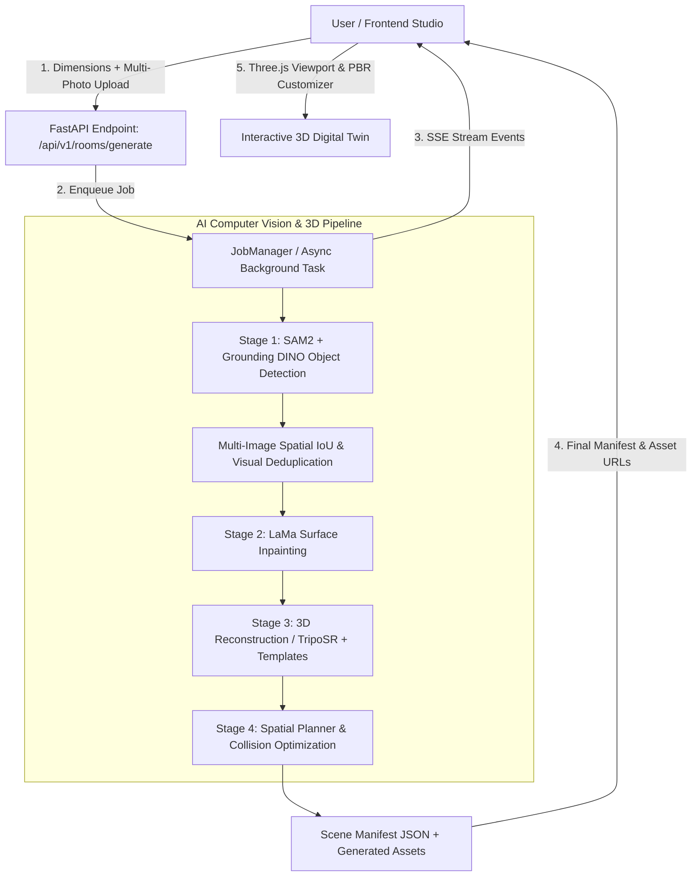

# Renovix System Architecture & Processing Workflow

This document details the architectural pipeline and data transformation workflow executed by **Renovix** to transform 2D room photos and physical boundary dimensions into an interactive, parametric 3D digital twin.

---

## 🔄 End-to-End Pipeline Stages

### Stage 1: Room Dimensions & Boundary Configuration
- **Inputs**: Width ($X$), Length ($Z$), Height ($Y$) in meters or feet/inches, plus optional door placement specifications (wall alignment and offset).
- **Function**: Establishes the real-world boundary bounding box for spatial planning and Three.js parametric shell generation.

---

### Stage 2: Semantic Segmentation & Object Detection
- **Models**: Grounding DINO (Open-Vocabulary Zero-Shot Object Detection) + Segment Anything Model 2 (SAM 2).
- **Process**:
  1. Identifies interior objects (beds, sofas, tables, chairs, monitors, lamps, etc.).
  2. Generates precise RGBA cutouts and normalized bounding boxes $[x_{\min}, y_{\min}, x_{\max}, y_{\max}]$.
  3. Samples dominant color and material properties from photo regions.

---

### Stage 3: Multi-View Spatial & Visual NMS Deduplication
- **Challenge**: When uploading multiple angles of a room, identical furniture items appear across multiple photos.
- **Solution**:
  1. Compares bounding box aspect ratios, class labels, and dominant RGB color vectors.
  2. Merges duplicate candidate detections across views, preventing duplicated 3D meshes in the staging output.

---

### Stage 4: Surface & Texture Inpainting (LaMa)
- **Model**: Large Mask Inpainting (LaMa).
- **Process**:
  1. Inverts detected furniture masks to compute room background regions.
  2. Inpaints occluded walls and floors behind removed objects to produce clean, high-resolution textures for the 3D room shell.

---

### Stage 5: 3D Mesh Generation & Spatial Planning
- **Mesh Synthesis**:
  - **TripoSR AI Reconstruction**: Generates textured `.glb` models from segmented object cutouts.
  - **Curated Template Catalog**: Maps detected labels to customizable parametric PBR templates (e.g., minimalist bed, ergonomic chair, study desk).
- **Spatial Optimization**:
  - Multimodal Vision LLM (Gemini 1.5/2.0 Pro/Flash or GPT-4o) or geometric projection calculates metric $[x, y, z]$ coordinates, bounding box extents, and $Y$-axis rotations.
  - Aligns furniture flush against detected boundary walls and door clearances.

---

### Stage 6: Real-Time SSE Stream & Interactive WebGL Studio
- **Server-Sent Events (SSE)**: Streams progress percentage ($0\% \to 100\%$) and detected object metadata (`/api/v1/rooms/{id}/stream`) live to the client.
- **Frontend Staging Studio**:
  - OrbitControls, pan, zoom, contact shadows, and dimension overlays.
  - PBR Material & Color customizer (Oak Wood, Walnut, Marble, Velvet, Brushed Metal, Leather, etc.).
  - Wall-alignment snappers, live 90° rotation, and JSON scene layout export/import.
